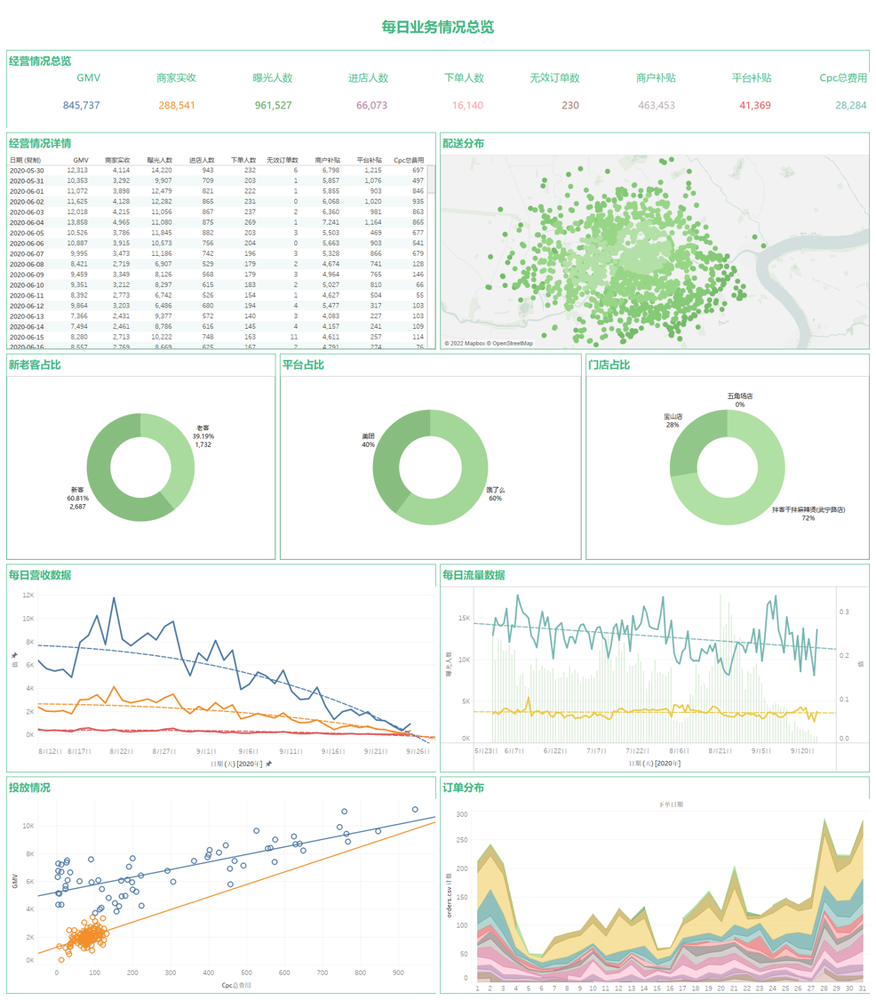

# Tableau

[[toc]]

## 工具对比

**Excel**
- 容易上手
- 功能强大
- 过程难以复用和自动化
- 无法处理大量级数据: 10w卡, 30w彻底跑不了

**SQL**
-  功能强大, 但只擅长于取数和业务查询
- 可以重复执行和自动化

**Python/R**
- 学习难度高
- 功能强大, 数据处理, 描述性分析和算法建模都能做
- 可以重复执行和自动化

**Tableau**
- 容易上手
- 美观直接
- 功能强大, 尤其在数据探索和可视化绝对是第一名
- 可以重复执行
- 历史悠久
  - 20世纪90年代从美军的战地可视化项目演变而来
  - 2003年正式独立成为商业软件
  - 一直不断进化迭代了近20年

## Tableau可视化原理

度量默认聚合

度量值会形成图形标记, 图形标记可以切换

维度会对度量值进行区分, 增加度量值的信息密度 (单个图表传达信息的多少)

图表分为有轴图表和无轴图表 (极坐标图表)

离散形成标签, 连续形成数轴

## 数据可视化原则

区分用户

主次分明, 详略得当

真实准确

符合大众认知和审美习惯

适度原则

五秒原则

少即是多

可视化案例

## 仪表盘成果展示

