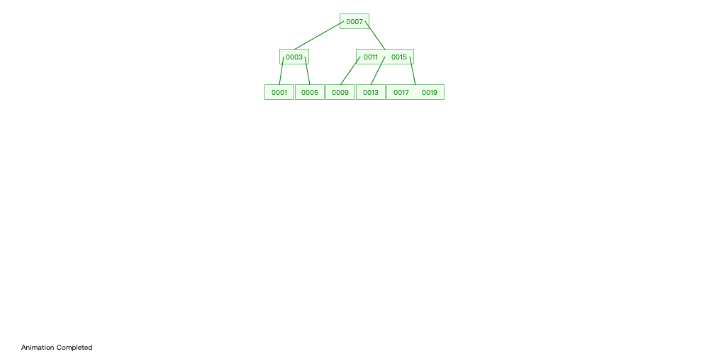
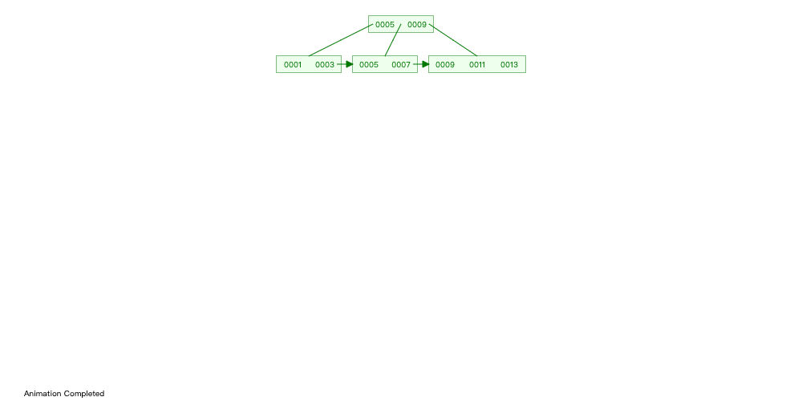

# Computer Basics

[[toc]]

## 操作系统

### select poll epoll

基本上 select 有3个缺点:

- 连接数受限
- 查找配对速度慢
- 数据由内核拷贝到用户态

poll 改善了第一个缺点

epoll 改了三个缺点

### 调度算法

- 先来先服务(FCFS, First Come First Serve)
- 短作业优先(SJF, Shortest Job First)
- 最高优先权调度(Priority Scheduling)
- 时间片轮转(RR, Round Robin)
- 多级反馈队列调度(multilevel feedback queue scheduling)

实时调度算法:

- 最早截至时间优先 EDF
- 最低松弛度优先 LLF

## 计算机网络

### TCP/IP

TCP/IP 是用于因特网 (Internet) 的通信协议.  TCP/IP 通信协议是对计算机必须遵守的规则的描述, 只有遵守这些规则, 计算机之间才能进行通信

TCP/IP是基于TCP和IP这两个最初的协议之上的不同的通信协议的大集合

#### 协议的分层

网络协议通常分不同层次进行开发, 每一层分别负责不同的通信功能. 一个协议族, 比如TCP/IP, 是一组不同层次上的多个协议的组合.  传统上来说 TCP/IP 被认为是一个四层协议, 而ISO (国际标准化组织), 制定了一个国际标准OSI七层协议模型, OSI协议以OSI参考模型为基础界定了每个阶层的协议和每个阶层之间接口相关的标准

| 分层      | 简介 |
| :------  | :-------    | 
| 应用层    | 应用层为操作系统或网络应用程序提供访问网络服务的接口. 应用层协议的代表包括: Telnet, FTP, HTTP, SNMP等      |
| 表示层    | 将应用处理的信息转换为适合网络传输的格式, 或将来自下一层的数据转换为上层能够处理的格式. 数据的表示, 安全, 压缩       |
| 会话层    | 负责建立和断开通信连接 (数据流动的逻辑通路), 以及数据的分割等数据传输相关的管理      | 
| 传输层    | 管理两个节点之间的数据传输. 负责可靠传输 (确保数据被可靠地传送到目标地址)      | 
| 网络层    | 地址管理与路由选择, 在这一层, 数据的单位称为数据包 (packet) (路由器)      | 
| 数据链路层| 互连设备之间传送和识别数据帧 (交换机)      | 
| 物理层    | 以 "0",  "1" 代表电压的高低, 灯光的闪灭, 在这一层, 数据的单位称为比特 (bit), (中继器, 集线器, 还有我们通常说的双绞线也工作在物理层)      | 


#### TCP/UDP

TCP(Transimision Control Protocal)
- 传输控制协议
- 可靠的, 面向连接的协议
- 传输效率低

UDP(User Datagram Protocal)
- 用户数据报协议
- 不可靠的, 无连接的服务
- 传输效率高

#### 三次握手 四次挥手

**建立连接**

一个TCP连接必须要经过三次 "对话" 才能建立起来, 其中的过程非常复杂, 只简单的描述下这三次对话的简单过程: 主机A向主机B发出连接请求数据包: "我想给你发数据, 可以吗\?", 这是第一次对话; 主机B向主机A发送同意连接和要求同步 (同步就是两台主机一个在发送, 一个在接收, 协调工作)的数据包: "可以, 你什么时候发\?", 这是第二次对话; 主机A再发出一个数据包确认主机B的要求同步: "我现在就发, 你接着吧!", 这是第三次对话. 三次 "对话" 的目的是使数据包的发送和接收同步, 经过三次 "对话" 之后, 主机A才向主机B正式发送数据

**释放连接**

当客户A没有东西要发送时就要释放A这边的连接, A会发送一个报文 (没有数据), 其中 FIN 设置为1, 服务器B收到后会给应用程序一个信, 这时A那边的连接已经关闭, 即A不再发送信息 (但仍可接收信息). A收到B的确认后进入等待状态, 等待B请求释放连接, B数据发送完成后就向A请求连接释放, 也是用 FIN=1 表示,  并且用 ack = u+1,  A收到后回复一个确认信息, 并进入 TIME_WAIT 状态,  等待 2MSL 时间

### HTTP

超文本传输协议 (Hyper Text Transfer Protocol, HTTP) 是一个简单的请求-响应协议, 它通常运行在TCP之上. 它指定了客户端可能发送给服务器什么样的消息以及得到什么样的响应. 请求和响应消息的头以ASCII形式给出; 而消息内容则具有一个类似MIME的格式

HTTP是应用层协议, 同其他应用层协议一样, 是为了实现某一类具体应用的协议, 并由某一运行在用户空间的应用程序来实现其功能. HTTP是一种协议规范, 这种规范记录在文档上, 为真正通过HTTP进行通信的HTTP的实现程序

#### 工作原理

HTTP是基于客户/服务器模式, 且面向连接的. 典型的HTTP事务处理有如下的过程: 
- 客户与服务器建立连接
- 客户向服务器提出请求
- 服务器接受请求, 并根据请求返回相应的文件作为应答
- 客户与服务器关闭连接

#### 报文格式

HTTP报文由从客户机到服务器的请求和从服务器到客户机的响应构成. 请求报文格式如下: 

请求行 － 通用信息头 － 请求头 － 实体头 － 报文主体

应答报文格式如下: 

状态行 － 通用信息头 － 响应头 － 实体头 － 报文主体

#### Cookie  Session

| #       | Cookie      | Session            | 
| :------ | :-------    | :------------- | 
| 储存位置 | 客户端      | 服务器端 | 
| 目的     | 跟踪会话, 也可以保存用户偏好设置或者保存用户名密码等       | 跟踪会话 |
| 安全性   | 不安全      | 安全 |


## 数据结构

### 线性表

线性表, 数据结构中最简单的一种存储结构, 专门用于存储逻辑关系为 "一对一" 的数据. 基于数据在实际物理空间中的存储状态, 又可细分为顺序表 (顺序存储结构) 和链表 (链式存储结构)


#### 顺序表

将数据依次存储在连续的整块物理空间中, 这种存储结构称为顺序存储结构 (简称顺序表)


#### 链表

数据分散的存储在物理空间中, 通过一根线保存着它们之间的逻辑关系, 这种存储结构称为链式存储结构 (简称链表)

```python
class ListNode:
    def __init__(self, value):
        self.value = value
        self.next = None
```

### 树

树 (Tree) 是n (n≥0) 个结点的有限集, 它或为空树 (n=0); 或为非空树

#### 二叉树

```python
class TreeNode:
    def __init__(self, value):
        self.value = data
        self.left = None
        self.right = None
```

#### B树



#### B+树



### 图

图由顶点和边组成

```python
Graph = {
    'A':  ['B', 'C', 'D'],
    'B':  ['E'],
    'C':  ['D', 'F'],
    'D':  ['B', 'E', 'G'],
    'E':  [],
    'F':  ['D', 'G'],
    'G':  ['E']
}
```